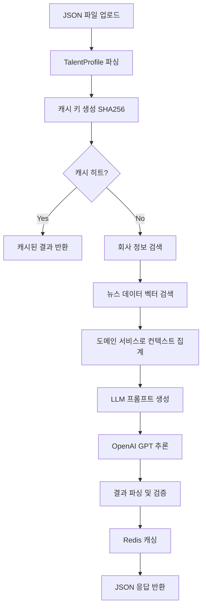
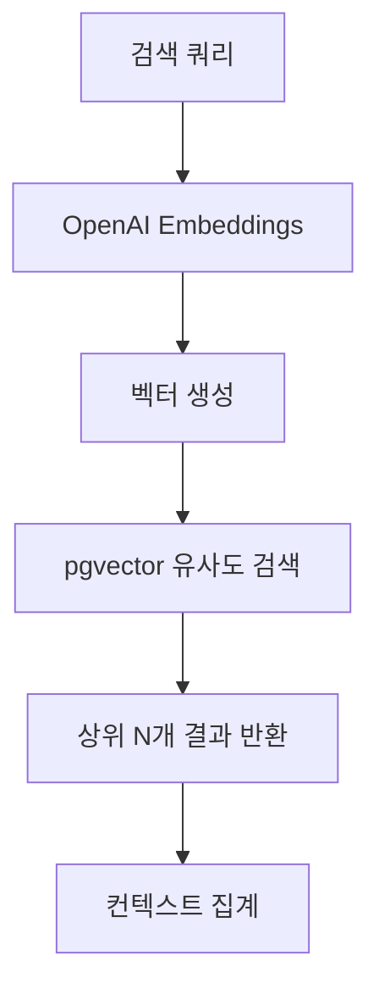
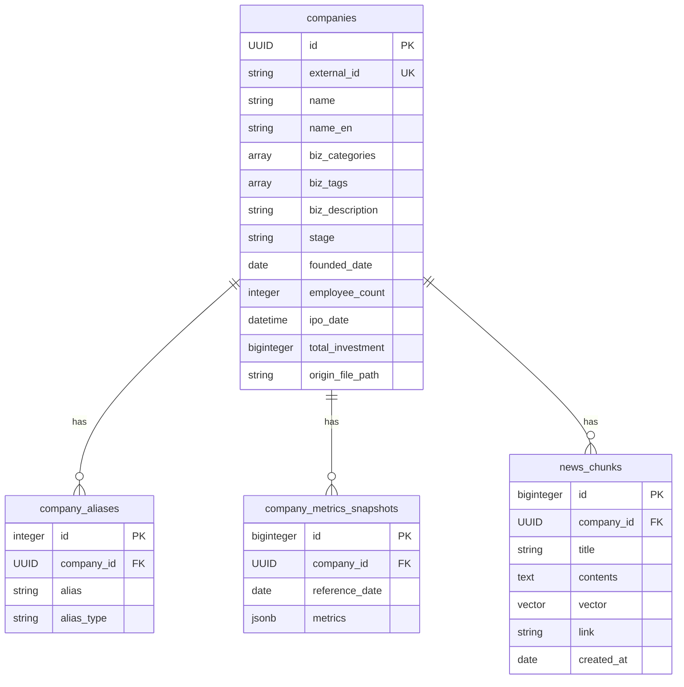

# RAG 기반 인재 추론 시스템

## 📋 프로젝트 개요

인재의 경력 정보(회사, 직무, 재직 기간)를 기반으로 LLM을 활용하여 경험 태그와 역량을 추론하는 RAG(Retrieval-Augmented Generation) 시스템.

### 🎯 핵심 기능
- **인재 프로필 분석**: JSON 형태의 인재 데이터를 입력받아 경험 태그 추론
- **회사 정보/지표 검색**: 재직기간 동안의 회사 정보 및 지표 조회
- **벡터 검색**: pgvector를 활용한 회사 정보 및 뉴스 데이터 유사도 검색
- **LLM 기반 추론**: OpenAI GPT 모델을 사용한 컨텍스트 기반 경험 추론
- **Redis 캐싱**: SHA256 기반 캐시 키를 사용한 추론 결과 캐싱
- **RESTful API**: FastAPI 기반 비동기 API 서버

## 🛠 기술 스택

### 백엔드 프레임워크
- **FastAPI**: 비동기 웹 프레임워크
- **Python 3.13+**: 최신 Python 버전
- **SQLAlchemy**: ORM 및 데이터베이스 추상화
- **Alembic**: 데이터베이스 마이그레이션

### 데이터베이스 및 캐싱
- **PostgreSQL + pgvector**: 벡터 유사도 검색 지원
- **Redis**: 추론 결과 캐싱
- **OpenAI Embeddings**: 텍스트 벡터화

### 아키텍처 패턴
- **DIP**
- **Domain-Driven Design**: 도메인 중심 설계
- **Dependency Injection**: 의존성 주입 컨테이너 사용

### 개발 도구
- **Poetry**: 패키지 관리
- **Docker Compose**: 컨테이너 오케스트레이션
- **pytest**: 테스트 프레임워크
- **Black, Ruff, isort**: 코드 포맷팅 및 린팅

## 🚀 설치 및 실행 방법

### 1. 사전 요구사항
```bash
# Python 3.13+ 설치
# Poetry 설치
curl -sSL https://install.python-poetry.org | python3 -
```

### 2. 프로젝트 설정
```bash
# 프로젝트 클론
git clone <repository-url>
cd AI-technical-assignment

# 의존성 설치
poetry install

# 가상환경 활성화
poetry shell (plugin 필요)
```

### 3. 환경 변수 설정
```bash
# .env 파일 생성
cp ./.env-example .env
cp .env-migrations-example .env-migrations

# 환경 변수 수정
OPENAI_API_KEY=your_openai_api_key_here
```

### 4. 서비스 실행
```bash
# Docker Compose로 pg 컨테이너 실행
docker-compose up -d postgres

# 데이터베이스 마이그레이션
alembic upgrade heads

# 셈플 데이터
python -m tools.init_data

# 개발 서버 실행
docker-compose up -d
```

## 📡 API

### 메인 API 엔드포인트

#### 인재 경험 추론 API
```bash
POST /api/v1/inferences/talent-profile-analyses
Content-Type: multipart/form-data

```
#### 회사 정보 저장 API
```bash
POST /api/v1/enrichments/data-sources
```

#### 헬스 체크
```bash
GET /health
```

### 입력 파일 형식
```json
{
  "firstName": "홍길동",
  "lastName": "",
  "headline": "Software Engineer",
  "summary": "경험 많은 소프트웨어 엔지니어",
  "positions": [
    {
      "companyName": "토스",
      "title": "Senior Software Engineer",
      "description": "결제 시스템 개발",
      "startEndDate": {
        "start": {"year": 2020, "month": 3},
        "end": {"year": 2023, "month": 6}
      }
    }
  ],
  "educations": [
    {
      "schoolName": "서울대학교",
      "degree": "학사",
      "fieldOfStudy": "컴퓨터공학"
    }
  ]
}
```

### 응답 데이터 형식
```json
{
  "experience_tags": [
    "성장기스타트업경험",
    "리더십",
    "핀테크도메인경험"
  ],
  "competency_tags": [
    "백엔드개발",
    "결제시스템",
    "대규모서비스"
  ],
  "inferences": [
    {"tag": "성장기스타트업경험", "inference": ""},
    {"tag": "리더십", "inference": ""},
    {"tag": "핀테크도메인경험", "inference": ""},
  ]
}
```

## 🏗 프로젝트 구조

```
src/
├── config/                    # 설정 파일
│   └── config.py              # 환경 변수 및 설정 관리
├── containers.py              # DI 컨테이너 설정
├── server.py                  # FastAPI 애플리케이션 진입점
├── shared/                    # 공통 모듈
│   ├── cache/                 # 캐싱 관련
│   │   ├── cache_port.py      # 캐시 포트 (인터페이스)
│   │   └── redis_cache_adapter.py  # Redis 캐시 구현체
│   └── exceptions.py          # 공통 예외 처리
├── enrichment/                # 데이터 도메인
│   ├── domain/                # 도메인 계층
│   │   ├── aggregates/        # 애그리게이트
│   │   ├── entities/          # 엔티티
│   │   ├── repositories/      # 리포지토리 포트
│   │   └── vos/               # 값 객체
│   ├── application/           # 애플리케이션 계층
│   │   ├── services/          # 애플리케이션 서비스
│   │   └── ports/             # 외부 의존성 포트
│   ├── infrastructure/        # 인프라스트럭처 계층
│   │   ├── repositories/      # 리포지토리 구현체
│   │   ├── readers/           # 데이터 리더
│   │   ├── orm/               # ORM 모델
│   │   └── embeddings/        # 임베딩(openai) 클라이언트 
│   └── controllers/           # 컨트롤러 계층
└── inference/                 # 추론 도메인
    ├── domain/                # 도메인 계층
    │   ├── aggregates/        # 애그리게이트
    │   ├── entities/          # 회사, 뉴스 엔티티
    │   ├── services/          # 도메인 서비스
    │   └── vos/               # 값 객체
    ├── application/           # 애플리케이션 계층
    │   ├── services/          # TalentInference 서비스
    │   └── templates/         # 프롬프트 템플릿
    ├── infrastructure/        # 인프라스트럭처 계층
    │   └── adapters/          # 외부 서비스 어댑터
    └── controllers/           # API 컨트롤러
```
## 🔄 시스템 플로우

### 1. 전체 추론 프로세스


### 2. 벡터 검색 프로세스


## 🗄️ 데이터베이스 스키마

### 테이블 구조

#### 1. `companies` - 회사 정보 메인 테이블
회사의 기본 정보를 저장하는 메인 테이블로, Forest of Hyuksin의 JSON 데이터를 파싱하여 저장됩니다.

| 컬럼명 | 타입 | 설명 | 제약조건 |
|--------|------|------|----------|
| `id` | UUID | 회사 고유 식별자 | Primary Key |
| `external_id` | String(16) | 외부 시스템 회사 ID | Unique, Not Null, Index |
| `name` | String(64) | 회사명(한국어) | Index |
| `name_en` | String(64) | 회사명(영어) | Index |
| `biz_categories` | ARRAY[String] | 사업 카테고리 목록 | Default: [] |
| `biz_tags` | ARRAY[String] | 비즈니스 태그 목록 | Default: [] |
| `biz_description` | String(255) | 사업 설명/소개 | |
| `stage` | String(32) | 투자 단계 (Series A/B 등) | |
| `founded_date` | Date | 창립일 | |
| `employee_count` | Integer | 직원 수 | Default: 0 |
| `ipo_date` | DateTime | IPO 날짜 (상장일) | Nullable |
| `total_investment` | BigInteger | 총 투자 금액 | Default: 0 |
| `origin_file_path` | String(255) | 원본 데이터 파일 경로 | |

#### 2. `company_aliases` - 회사 별칭 테이블
회사명, 제품명 등 회사를 식별할 수 있는 다양한 이름들을 저장합니다.

| 컬럼명 | 타입 | 설명 | 제약조건 |
|--------|------|------|----------|
| `id` | Integer | 별칭 ID | Primary Key, Auto Increment |
| `company_id` | UUID | 회사 ID (외래키) | Foreign Key, Index |
| `alias` | String(100) | 별칭 이름 | Index |
| `alias_type` | String(20) | 별칭 타입 (name, product 등) | Not Null, Index |

#### 3. `company_metrics_snapshots` - 회사 메트릭 스냅샷 테이블
회사의 시계열 데이터를 월별로 저장하는 테이블입니다.

| 컬럼명 | 타입 | 설명 | 제약조건 |
|--------|------|------|----------|
| `id` | BigInteger | 스냅샷 ID | Primary Key, Auto Increment |
| `company_id` | UUID | 회사 ID (외래키) | Foreign Key, Index |
| `reference_date` | Date | 기준 날짜 (매월 1일) | Index |
| `metrics` | JSONB | 메트릭 데이터 (MonthlyMetrics) | Default: {} |

**인덱스**: `idx_company_date` (company_id, reference_date)

#### 4. `news_chunks` - 뉴스 청크 테이블
뉴스 기사를 청크 단위로 분할하여 벡터 임베딩과 함께 저장합니다.

| 컬럼명 | 타입 | 설명 | 제약조건 |
|--------|------|------|----------|
| `id` | BigInteger | 청크 ID | Primary Key, Auto Increment |
| `company_id` | UUID | 회사 ID (외래키) | Foreign Key, Index |
| `title` | String(500) | 뉴스 제목 | Not Null, Index |
| `contents` | Text | 청크 내용 | Not Null |
| `vector` | Vector(1536) | 벡터 임베딩 (text-embedding-3-small) | Not Null |
| `link` | String(500) | 원본 뉴스 링크 | Not Null, Index |
| `created_at` | Date | 뉴스 생성 날짜 | Not Null, Index |

**인덱스**:
- `idx_chunk_hnsw`: HNSW 벡터 검색 인덱스 (cosine 거리 기준)
- `idx_news_chunk_created_at_company_id`: created_at, company_id 복합 인덱스

### 테이블 관계도



### 벡터 검색 최적화

- **pgvector 확장**: PostgreSQL에서 벡터 유사도 검색 지원
- **HNSW 인덱스**: 높은 성능의 근사 최근접 이웃 검색
- **1536차원 임베딩**: OpenAI text-embedding-3-small 모델 사용
- **코사인 유사도**: 벡터 간 유사도 계산 방식

## 🧪 테스트

### 테스트 실행
```bash
# 모든 테스트 실행
pytest tests
```
